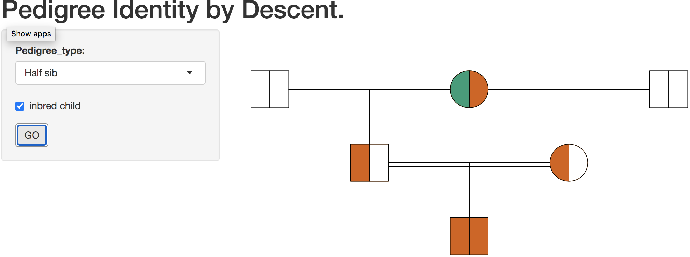
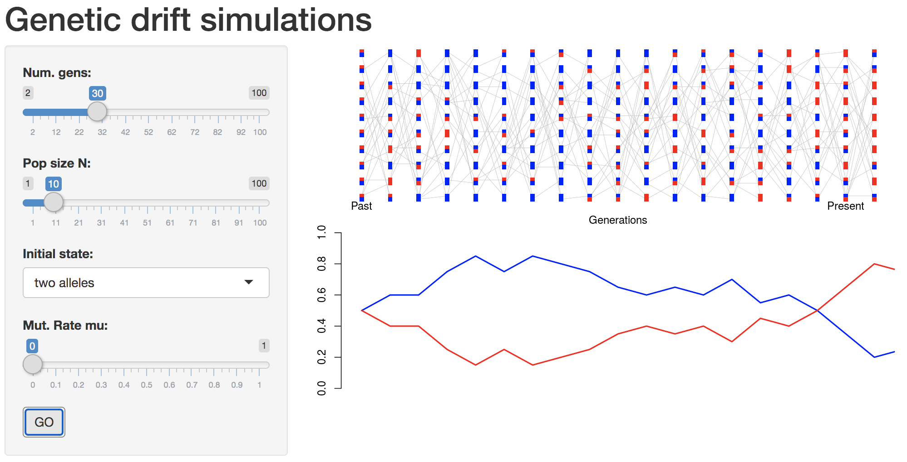
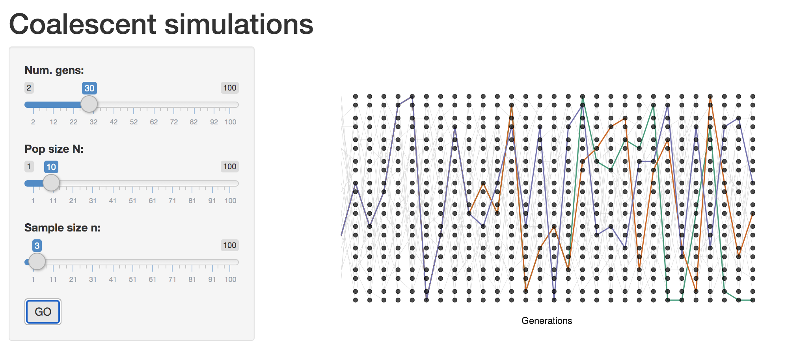
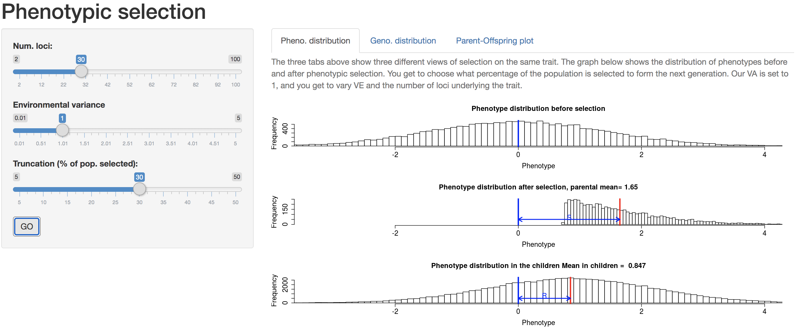
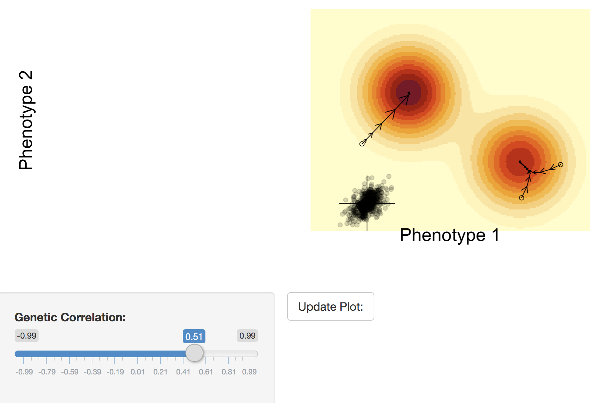

# Popgen teaching code

Code to illustrate various ideas in population genetics. This code accompanies the [Population and Quantitative Genetics notes](https://github.com/cooplab/popgen-notes/releases).

Feel free to reuse/repurpose this code.

To run these shinys locally using the following code. 
```R
##download the required packages. Note kinship2 is needed only for drawing the pedigrees in IBD_pedigree and mvtnorm for the 2D fitness landscapes
pkgs <- c("RColorBrewer","shiny","kinship2","mvtnorm")
dl_pkgs <- subset(pkgs,!pkgs %in% rownames(installed.packages()))
if(length(dl_pkgs)!=0){
  for(i in dl_pkgs) install.packages(i)
}
### above borrowed from https://github.com/cjbattey/ldsim

library(shiny)

##choose one of the following
runGitHub("cooplab/Popgen_teaching_code/",subdir ="IBD_pedigree")
runGitHub("cooplab/Popgen_teaching_code/",subdir = "Simulate_drift")
runGitHub("cooplab/Popgen_teaching_code/",subdir ="Simple_coalescent")
runGitHub("cooplab/Popgen_teaching_code/",subdir = "Pheno_selection")
runGitHub("cooplab/Popgen_teaching_code/",subdir ="2d_fitness_landscape")


```
This software is free for use or modification under the GNU General Public License 3.0 (https://opensource.org/licenses/GPL-3.0)

```R
runGitHub("cooplab/Popgen_teaching_code/",subdir ="IBD_pedigree")
```

```R
runGitHub("cooplab/Popgen_teaching_code/",subdir = "Simulate_drift")
```

```R
runGitHub("cooplab/Popgen_teaching_code/",subdir ="Simple_coalescent")
```

```R
runGitHub("cooplab/Popgen_teaching_code/",subdir ="Pheno_selection")
```
Note the three tabs


```R
runGitHub("cooplab/Popgen_teaching_code/",subdir ="2d_fitness_landscape")
```



